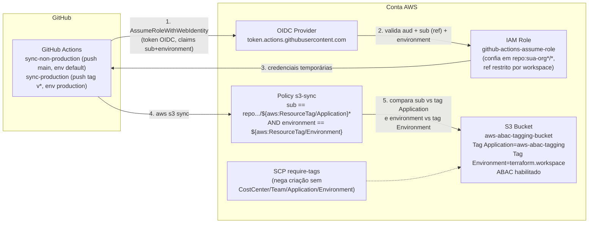

# AWS Tagging beyond key-values: ABAC authorization demo

## Resumo

Este repositório demonstra **ABAC (Attribute-Based Access Control)** na AWS usando tags como atributo de decisão, em vez do modelo tradicional de uma role/policy por recurso ou por time. Uma única IAM Role, confiável por toda a organização do GitHub via OIDC, só consegue sincronizar arquivos para um bucket S3 quando a tag `Application` do bucket bate com o nome do repositório que está chamando — a autorização nasce da comparação entre um atributo do token (`sub`) e um atributo do recurso (tag), não de uma lista fixa de permissões por repositório. O repo também traz uma SCP que garante que todo bucket S3 criado na conta carregue o conjunto mínimo de tags (`CostCenter`, `Team`, `Application`, `Environment`), e um pipeline de GitHub Actions que serve como demo funcional de ponta a ponta.

## Como funciona

1. O GitHub Actions do repositório assume a IAM Role via **OIDC** (`sts:AssumeRoleWithWebIdentity`), sem credenciais de longa duração.
2. A trust policy da Role confia em qualquer repositório da sua org/usuário do GitHub, definida em `local.github_org` (claim `sub` do token, com wildcard — ver seção abaixo), **e** restringe o `ref` aceito de acordo com o ambiente (`terraform.workspace`) — ver [Restrição de ambiente](#restrição-de-ambiente-por-terraformworkspace) abaixo.
3. A policy de permissão anexada à Role (`s3:PutObject`, `s3:GetObject`, `s3:DeleteObject`, `s3:ListBucket`) só libera acesso a um bucket se **duas** condições baterem ao mesmo tempo (`AND`): a claim `sub` do token (que contém o nome do repo) bater com a tag `Application` do bucket, e a claim `environment` do token (o [GitHub Environment](https://docs.github.com/en/actions/deployment/targeting-different-environments/using-environments-for-deployment) configurado no job) bater com a tag `Environment` do bucket — ambas usando [policy variables](https://docs.aws.amazon.com/IAM/latest/UserGuide/reference_policies_variables.html) (`${aws:ResourceTag/Application}` / `${aws:ResourceTag/Environment}`) dentro de condições `StringLike`/`StringEquals`. Ver [Restrição por GitHub Environment](#restrição-por-github-environment) abaixo.
4. O bucket (`my-demo-bucket/`) tem [ABAC habilitado a nível de bucket](https://docs.aws.amazon.com/AmazonS3/latest/userguide/buckets-tagging-enable-abac.html) (`aws_s3_bucket_abac`), necessário para que `aws:ResourceTag` seja avaliado em ações de bucket como `ListBucket`.
5. Um conjunto de tags (`CostCenter`, `Team`, `Application`, `Environment`) é o "contrato" de atributos usado tanto pela Role quanto pela SCP de guardrail (`abac/scp.tf`), que nega a criação de buckets sem essas tags.

### Formato da claim `sub` do GitHub

O GitHub adicionou IDs numéricos imutáveis ao claim `sub` (ex.: `repo:sua-org@7799231/seu-repo@1335473687:ref:refs/heads/main`), além do formato antigo (`repo:sua-org/seu-repo:ref:...`). Os wildcards nas condições (`repo:${github_org}*/*`) cobrem os dois formatos sem duplicar policies — veja [Available keys for AWS OIDC federation](https://docs.aws.amazon.com/IAM/latest/UserGuide/reference_policies_iam-condition-keys.html#condition-keys-wif).

### Restrição de ambiente por `terraform.workspace`

Além do match org/repo, a trust policy da Role (`abac/role.tf`, `local.allowed_ref_subs` em `abac/locals.tf`) restringe **qual `ref` do GitHub pode assumir a Role**, com base no workspace do Terraform (`terraform.workspace`) — sem precisar de nenhuma variável extra, já que o ambiente é decidido pelo próprio workspace usado no `apply`:

| Workspace | `local.is_production` | Refs aceitos na trust policy |
| --- | --- | --- |
| `production` | `true` | Somente **tags** git — `refs/tags/*` (ex.: releases `v1.2.3`) |
| qualquer outro (`default`, `staging`, `dev`, ...) | `false` | Somente **push/branch** `main` ou `master` |

Ou seja:

- **Em produção**, só um `ref` de tag (`refs/tags/*`) consegue fazer `AssumeRoleWithWebIdentity` — um push direto em `main` no workspace `production` é rejeitado na trust policy, antes mesmo de chegar na policy ABAC de tags do bucket. Isso força o deploy em produção a passar por um processo de release (criar uma tag), não por qualquer push na branch principal.
- **Fora de produção**, só um `ref` de branch `main` ou `master` consegue assumir a Role — pushes em outras branches ou tags são rejeitados. Isso mantém os ambientes de não-produção atrelados à branch principal, sem abrir para qualquer branch de feature.

Essa restrição de `ref` é somada (`AND`, já que ambas as condições `StringLike` estão na mesma statement) à condição de `aud` já existente — ela não substitui, e não interfere, na condição ABAC de tags (`aws:ResourceTag/Application`) que continua controlando o acesso por repositório em `abac/policies.tf`.

Para trocar de workspace localmente:

```sh
cd abac
terraform workspace new production   # ou: terraform workspace select production
mise exec -- terraform plan
```

> Nenhum outro recurso muda de comportamento com o workspace hoje além dessa condição de `ref` — as tags `Environment` (em `abac/locals.tf` e `my-demo-bucket/locals.tf`) já usavam `terraform.workspace` antes desta mudança.

### Restrição por GitHub Environment

Além da restrição de `ref` na trust policy, a **policy de permissão** `s3-sync` (`abac/policies.tf`) exige que o job do GitHub Actions esteja rodando dentro de um [GitHub Environment](https://docs.github.com/en/actions/deployment/targeting-different-environments/using-environments-for-deployment) (`environment:` no job) cujo **nome bata com a tag `Environment` do bucket**:

```hcl
condition {
  test     = "StringEquals"
  variable = "${local.github_oidc_domain}:environment"
  values   = ["$${aws:ResourceTag/Environment}"]
}
```

A claim `environment` é diferente da claim `sub` — ela só existe no token OIDC quando o job declara `environment: <nome>` no workflow (ver [Available keys for AWS OIDC federation](https://docs.aws.amazon.com/IAM/latest/UserGuide/reference_policies_iam-condition-keys.html#condition-keys-wif)); se o job não declarar nenhum `environment`, a claim não é emitida e essa condição falha (nega o acesso). Isso significa:

- O nome do GitHub Environment usado no job **tem que ser literalmente igual** ao valor da tag `Environment` do bucket alvo, que por sua vez é `terraform.workspace` (`my-demo-bucket/locals.tf`). No workspace padrão isso é `default`; no workspace `production`, é `production`.
- Essa condição é somada (`AND`) à condição existente de `sub`/tag `Application` — ou seja, o repositório certo já não basta: o job também precisa estar rodando no GitHub Environment com o nome certo.
- No workflow deste repo (`.github/workflows/deploy.yml`), isso é implementado com dois jobs: `sync-non-production` (push em `main`, `environment: default`) e `sync-production` (push de tag `v*`, `environment: production`) — cada um casando com a mesma condição de `ref` da trust policy (seção anterior) e com o GitHub Environment correspondente.
- [GitHub Environments](https://docs.github.com/en/actions/deployment/targeting-different-environments/using-environments-for-deployment) também podem ter suas próprias proteções (reviewers obrigatórios, branches/tags permitidas, secrets por ambiente) configuráveis em **Settings → Environments** no repositório — uma camada adicional de controle no lado do GitHub, complementar (não substitui) à condição ABAC do lado da AWS.

## Ativando a SCP (`scp_target_id`)

Os recursos da SCP em `abac/scp.tf` (`aws_organizations_policy.require_tags`) são sempre criados, mas só ficam **anexados** a algo se a variável `scp_target_id` (definida em `abac/variables.tf`) for preenchida — por padrão ela é `""` e o `aws_organizations_policy_attachment` nem é criado (`count = 0`). Isso só funciona se a conta AWS for a **management account** de uma [AWS Organization](https://docs.aws.amazon.com/organizations/latest/userguide/orgs_getting-started_concepts.html); em conta standalone, deixe a variável vazia mesmo.

Para descobrir o ID do root ou de uma OU e aplicar:

```sh
# ID do root da organização
aws organizations list-roots --query "Roots[0].Id" --output text
# ex.: r-abc1

# (opcional) IDs de OUs específicas dentro do root
aws organizations list-organizational-units-for-parent \
  --parent-id r-abc1 --query "OrganizationalUnits[].{Id:Id,Name:Name}"
```

Depois, aplique passando o ID (root ou OU) via `-var`:

```sh
cd abac
mise exec -- terraform apply -var="scp_target_id=r-abc1"
```

Ou, para deixar fixo no repositório, crie `abac/terraform.tfvars` (já ignorado pelo `.gitignore`):

```hcl
scp_target_id = "r-abc1"
```

## Arquitetura



## Estrutura do repositório

| Caminho | Conteúdo |
| --- | --- |
| `abac/` | OIDC provider (data source), IAM Role genérica, policy ABAC de sync S3, SCP de tags obrigatórias |
| `my-demo-bucket/` | Bucket S3 do demo, tags, bloqueio de acesso público, ABAC habilitado |
| `.github/workflows/deploy.yml` | Pipeline: assume role via OIDC + `aws s3 sync` |
| `Makefile` | `make fmt` / `make validate` / `make plan` via [mise](https://mise.jdx.dev/) |

## Roteiro de teste

Passo a passo para validar a SCP de tags obrigatórias e o ABAC de sync na prática. Pressupõe que `scp_target_id` já foi configurado (seção acima), que `vars.ASSUME_ROLE_ARN` está definida no repositório do GitHub (Settings → Secrets and variables → Actions → Variables), e que os **GitHub Environments** `default` e `production` existem no repositório (Settings → Environments → New environment) — sem eles, a claim `environment` não é emitida no token OIDC e o `s3 sync` é negado (ver [Restrição por GitHub Environment](#restrição-por-github-environment)).

### 1. Fazer um fork do repositório

Faça um fork deste repositório para a sua própria conta/organização do GitHub. Depois, ajuste `github_org` em `abac/locals.tf` para o nome da sua org/usuário no GitHub (o valor usado na trust policy da Role):

```hcl
github_org = "seu-usuario-ou-org"
```

E configure a variável `ASSUME_ROLE_ARN` no seu fork (Settings → Secrets and variables → Actions → Variables) com o ARN da Role que será criada no próximo passo — ela só existe depois do primeiro `terraform apply`, então pode deixar um valor provisório e atualizar depois.

### 2. Criar os recursos do `abac/`

```sh
cd abac
mise exec -- terraform apply -var="scp_target_id=<root-ou-ou-id-da-sua-organization>"
```

Isso cria a IAM Role, a policy ABAC de sync e anexa a SCP `require-tags` ao root da Organization — a partir daqui, **qualquer** conta dentro dela é bloqueada de criar bucket S3 sem as quatro tags.

### 3. Tentar criar o bucket sem uma tag (deve falhar)

Em `my-demo-bucket/locals.tf`, comente uma tag qualquer, por exemplo `CostCenter`:

```hcl
tags = {
  # CostCenter  = "payments"
  Team        = "pix"
  Application = "aws-abac-tagging"
  Environment = terraform.workspace
}
```

Aplique:

```sh
cd ../my-demo-bucket
mise exec -- terraform apply
```

O `apply` deve falhar com `AccessDenied` na chamada `CreateBucket`, algo como:

```
Error: creating S3 Bucket: operation error S3: CreateBucket, https response error
StatusCode: 403, ... AccessDenied: ... with an explicit deny in a service control policy
```

Isso confirma que a SCP está ativa e bloqueando a criação de recursos sem o conjunto completo de tags do ABAC.

### 4. Corrigir e criar o bucket

Descomente a tag e aplique de novo:

```hcl
tags = {
  CostCenter  = "payments"
  Team        = "pix"
  Application = "aws-abac-tagging"
  Environment = terraform.workspace
}
```

```sh
mise exec -- terraform apply
```

Agora o `apply` deve passar — bucket criado com as quatro tags, ABAC habilitado e acesso público bloqueado.

### 5. Fazer o deploy

O workflow (`.github/workflows/deploy.yml`) tem dois jobs, cada um casando com o workspace usado para criar o bucket:

- Se o bucket foi criado no workspace `default` (`terraform.workspace` = `default`, o padrão), dê `push` na branch `main` do seu fork. Isso dispara o job `sync-non-production` (`environment: default`, `ref` = `refs/heads/main`).
- Se o bucket foi criado no workspace `production` (`terraform workspace select production` antes do `apply` em `abac/` e `my-demo-bucket/`), crie e dê push numa tag `v*`, por exemplo `git tag v0.1.0 && git push origin v0.1.0`. Isso dispara o job `sync-production` (`environment: production`, `ref` = `refs/tags/*`).

Em ambos os casos, o job deve completar com sucesso: assume a Role via OIDC e sincroniza `my-demo-bucket/` para o bucket, já que a claim `sub` do token (`repo:sua-org/aws-abac-tagging...`) bate com a tag `Application` do bucket **e** a claim `environment` do job bate com a tag `Environment` do bucket.

### 6. Editar a tag `Application` no console (deve quebrar o próximo deploy)

No console AWS: **S3 → aws-abac-tagging-bucket → Properties → Tags**, mude o valor de `Application` para algo diferente do nome do repositório, por exemplo `outro-valor`.

Dispare o pipeline de novo (novo `push` em `main`/tag `v*`, ou re-run do workflow) **sem alterar o Terraform**. O passo `aws s3 sync` deve falhar com:

```
fatal error: An error occurred (AccessDenied) when calling the ListObjectsV2 operation: Access Denied
```

Isso acontece porque a condição `StringLike` da policy (`sub` do token vs. `${aws:ResourceTag/Application}`) não bate mais — a tag do bucket não corresponde ao repositório que está chamando, então o ABAC nega o acesso mesmo a Role sendo assumida com sucesso.

O mesmo tipo de falha acontece se você mudar a tag `Environment` do bucket para um valor que não bate com o GitHub Environment do job (`default`/`production`) — a condição `StringEquals` da claim `environment` passa a negar o acesso mesmo com a tag `Application` correta.

> Para reverter, basta rodar `terraform apply` em `my-demo-bucket/` de novo — o Terraform detecta o drift na tag e a restaura, já que ela é gerenciada via `local.tags`.

## Referências

- [IAM and AWS STS condition context keys — Available keys for AWS OIDC federation](https://docs.aws.amazon.com/IAM/latest/UserGuide/reference_policies_iam-condition-keys.html#condition-keys-wif)
- [IAM policy elements: Variables and tags](https://docs.aws.amazon.com/IAM/latest/UserGuide/reference_policies_variables.html)
- [Configuring a role for GitHub OIDC identity provider](https://docs.aws.amazon.com/IAM/latest/UserGuide/id_roles_create_for-idp_oidc.html#idp_oidc_Create_GitHub)
- [Enabling ABAC for S3 buckets (PutBucketAbac)](https://docs.aws.amazon.com/AmazonS3/latest/userguide/buckets-tagging-enable-abac.html)
- [SCPs — Example: Require a tag on create requests](https://docs.aws.amazon.com/organizations/latest/userguide/orgs_manage_policies_scps_examples_tagging.html)
- [aws-actions/configure-aws-credentials](https://github.com/aws-actions/configure-aws-credentials)

## Rodando localmente

```sh
make validate   # terraform init + validate em abac/ e my-demo-bucket/
make plan       # terraform plan em ambos (precisa de credenciais AWS)
```
